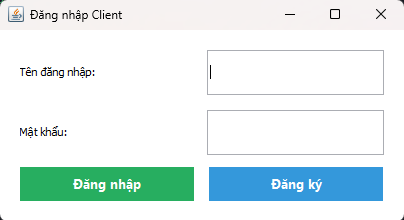
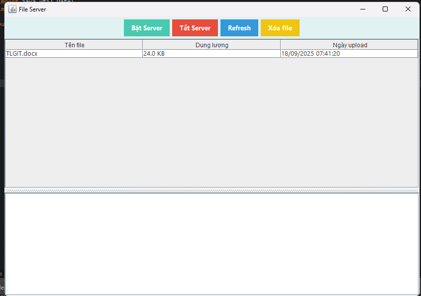
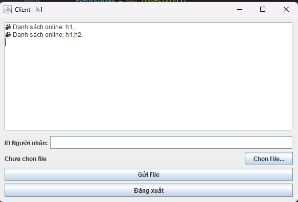
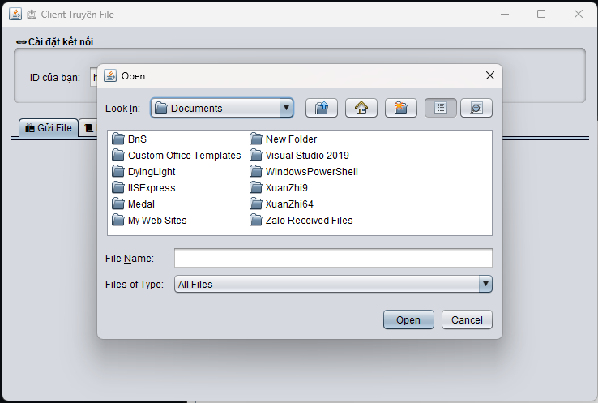
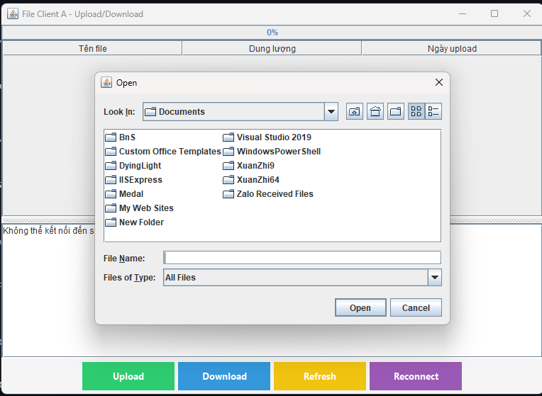
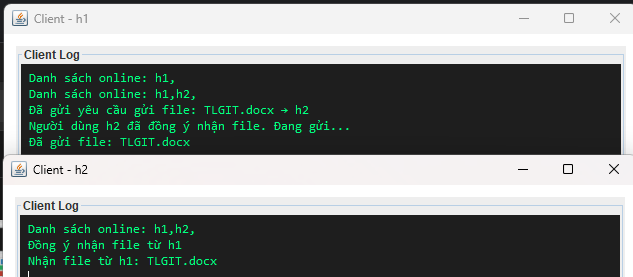
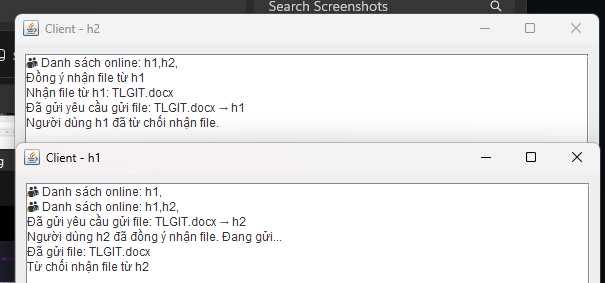
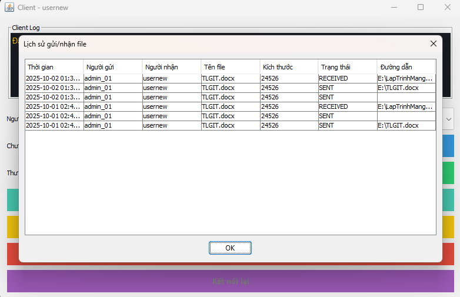

<h2 align="center">
    <a href="https://dainam.edu.vn/vi/khoa-cong-nghe-thong-tin">
    🎓 Faculty of Information Technology (DaiNam University)
    </a>
</h2>
<h2 align="center">
   TRUYỀN FILE QUA TCP
</h2>
<div align="center">
    <p align="center">
        
        
        
    </p>

[](https://www.facebook.com/DNUAIoTLab)
[](https://dainam.edu.vn/vi/khoa-cong-nghe-thong-tin)
[](https://dainam.edu.vn)

</div>

---

## 📖 1. Giới thiệu
Ứng dụng này mô phỏng việc **truyền file qua mạng** bằng mô hình **Client – Server**.  

- **Server**: Lắng nghe client kết nối, xác thực tài khoản (login/register qua MySQL), quản lý danh sách client và làm trung gian truyền file.  
- **Client**: Có 2 phần chính:
  - `LoginUI`: Đăng nhập hoặc đăng ký với server.  
  - `ClientUI`: Sau khi đăng nhập thành công, cho phép gửi/nhận file.  

**Mục tiêu chính:**  
- Hiểu nguyên lý hoạt động của giao thức TCP khi truyền dữ liệu.  
- Xây dựng ứng dụng Java Swing kết nối Client – Server.  
- Thực hành thao tác với CSDL MySQL, Socket và xử lý file.  

**Các chức năng chính:**  
- Đăng ký và đăng nhập tài khoản.  
- Gửi file từ một Client → Client khác thông qua Server.  
- Nhận file từ Client khác, đồng ý hoặc từ chối.  
- Cập nhật danh sách client online theo thời gian thực.  
- Quản lý nhiều client kết nối đồng thời.  

---

## 🛠️ 2. Công nghệ sử dụng  

<p align="center">
  
  
  
  
  
  
  
  
</p>

---

## 🚀 3. Một số hình ảnh hệ thống
### Giao diện đăng nhập và đăng ký

<p align="center">
  
</p>

### Giao diện Server

<p align="center">
  
</p>

### Giao diện Client

<p align="center">
  
</p>

### Chọn file để gửi

<p align="center">
  
</p>

### Nhận file từ client khác 

<p align="center">
  
</p>

### Đồng ý nhận file 

<p align="center">
  
</p>

### Từ chối nhận file 

<p align="center">
  
</p>

### Lịch sử gửi, nhận file

<p align="center">
  
</p>

---

## 📝 4. Các bước cài đặt

#### Bước 1: Chuẩn bị môi trường
1. **Cài đặt Java JDK** (phiên bản 8 trở lên).  
   Kiểm tra bằng lệnh:
   ```bash
   java -version
   javac -version
  ```

2. **Cài đặt MySQL và tạo CSDL mới:**
```bash
CREATE DATABASE `ltm-1604-d03-file-tcp`;
```

#### Bước 2: Cấu hình Database
- Chỉnh sửa thông tin kết nối trong file `sql/SQL.java`:
```bash
private static final String URL = "jdbc:mysql://localhost:3306/ltm-1604-d03-file-tcp";
private static final String USER = "root";
private static final String PASSWORD = "your_password_here";
```
- Chạy server lần đầu để tự động tạo bảng `users`.

#### Bước 3: Biên dịch mã nguồn
- Mở terminal, điều hướng đến thư mục project và chạy:
```bash
javac server/Server.java client/LoginUI.java client/Client.java sql/SQL.java
```
#### Bước 4: Chạy ứng dụng
1. Khởi động Server:
  ```bash
  java server.Server
  ```
- Server sẽ mở port 12345.
- Kết nối tới MySQL, tạo bảng users nếu chưa có.
2. Khởi động Client (LoginUI):
  ```bash
  java client.LoginUI
  ```
- Người dùng nhập tên đăng nhập + mật khẩu để login/register.
- Nếu thành công → mở giao diện Client.

3. Gửi/Nhận File:
- Client nhập ID người nhận, chọn file và gửi.
- Người nhận sẽ thấy thông báo, có thể Đồng ý hoặc Từ chối.
- File được lưu mặc định trong thư mục downloads/.

---

## 📌 5. Liên hệ cá nhân
Nếu có bất kỳ thắc mắc hoặc cần hỗ trợ, vui lòng liên hệ:

- Họ và tên: Phạm Thành Hưng
- Lớp: CNTT 16-04
- Khoa: Công nghệ thông tin - Trường Đại học Đại Nam
- Email: pthung0709@gmail.com

© 2025 AIoTLab, Faculty of Information Technology, DaiNam University. All rights reserved.


