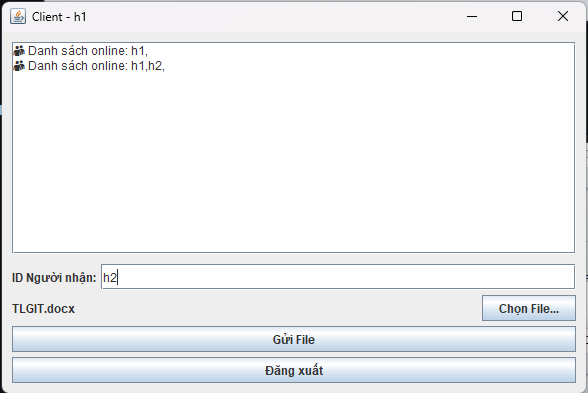

<h2 align="center">
    <a href="https://dainam.edu.vn/vi/khoa-cong-nghe-thong-tin">
    🎓 Faculty of Information Technology (DaiNam University)
    </a>
</h2>
<h2 align="center">
   TRUYỀN FILE QUA TCP
</h2>
<div align="center">
    <p align="center">
        
        
        
    </p>

[](https://www.facebook.com/DNUAIoTLab)
[](https://dainam.edu.vn/vi/khoa-cong-nghe-thong-tin)
[](https://dainam.edu.vn)

</div>

---

## 📖 1. Giới thiệu
Ứng dụng này mô phỏng việc **truyền file qua mạng** bằng mô hình **Client – Server**.  

- **Server**: Lắng nghe client kết nối, xác thực tài khoản (login/register qua MySQL), quản lý danh sách client và làm trung gian truyền file.  
- **Client**: Có 2 phần chính:
  - `LoginUI`: Đăng nhập hoặc đăng ký với server.  
  - `ClientUI`: Sau khi đăng nhập thành công, cho phép gửi/nhận file.  

**Mục tiêu chính:**  
- Hiểu nguyên lý hoạt động của giao thức TCP khi truyền dữ liệu.  
- Xây dựng ứng dụng Java Swing kết nối Client – Server.  
- Thực hành thao tác với CSDL MySQL, Socket và xử lý file.  

**Các chức năng chính:**  
- Đăng ký và đăng nhập tài khoản.  
- Gửi file từ một Client → Client khác thông qua Server.  
- Nhận file từ Client khác, đồng ý hoặc từ chối.  
- Cập nhật danh sách client online theo thời gian thực.  
- Quản lý nhiều client kết nối đồng thời.  

---

## 🛠️ 2. Công nghệ sử dụng  

- **Ngôn ngữ lập trình:** Java  
- **Mạng & Giao thức:** TCP, Socket (`java.net.Socket`, `java.net.ServerSocket`)  
- **Luồng dữ liệu:** `DataInputStream`, `DataOutputStream`  
- **Xử lý file:** `FileInputStream`, `FileOutputStream`  
- **Giao diện người dùng:** Java Swing (`JFrame`, `JPanel`, `JTextArea`, `JButton`, `JFileChooser`, `JLabel`, `JOptionPane`)  
- **CSDL:** MySQL (bảng `users`)  
- **JDBC Driver:** `com.mysql.cj.jdbc.Driver`  
- **Đa luồng:** `Thread` (xử lý client song song trên server, lắng nghe server trên client)  

---

## 🚀 3. Một số hình ảnh hệ thống
### Giao diện đăng nhập và đăng ký

<p align="center">
  
</p>

### Giao diện Server

<p align="center">
  
</p>

### Giao diện Client

<p align="center">
  
</p>

### Chọn file để gửi

<p align="center">
  
  
</p>

### Nhận file từ client khác 

<p align="center">
  
</p>

### Đồng ý nhận file 

<p align="center">
  
</p>

### Từ chối nhận file 

<p align="center">
  
</p>

---

## 📝 4. Các bước cài đặt

#### Bước 1: Chuẩn bị môi trường
1. **Kiểm tra Java**: Mở terminal/command prompt và chạy:
```bash
java -version
javac -version
```
Đảm bảo cả hai lệnh đều hiển thị phiên bản Java 8 trở lên.

#### Bước 2: Biên dịch mã nguồn
1. Mở terminal và điều hướng đến thư mục chứa mã nguồn.
2. Biên dịch các file Java:
```bash
javac server/Server.java
javac clienta/Client.java
```
- Hoặc biên dịch toàn bộ dự án:
```bash
javac LTM-1604-D03-File-TCP/**/*.java
```
3. Kiểm tra kết quả: Nếu biên dịch thành công, sẽ tạo ra các file `.class` tương ứng.

#### Bước 3: Chạy ứng dụng
Khởi động Server:
```bash
java server.Server
```
- Server lắng nghe kết nối TCP trên port 12345.
- Giao diện server hiển thị danh sách client và log các kết nối.

Khởi động Client:

```bash
java client.Client
```
- Nhập ID của client và IP server (mặc định localhost) để kết nối.
- Giao diện Client hiển thị log, danh sách online, chọn file và gửi file.

### 🚀 Sử dụng ứng dụng
1. Bật Server: Server sẵn sàng nhận kết nối từ Client.
2. Kết nối: Client kết nối đến Server, log hiển thị các client đang online.
3. Gửi file: Client nhập ID người nhận, chọn file và gửi.
4. Nhận file: Client khác đồng ý hoặc từ chối nhận file.
5. Kiểm tra lịch sử gửi/nhận file.
6. Ngắt kết nối: Client có thể ngắt kết nối với Server.
7. Dừng Server: Server sẽ ngừng lắng nghe các client.

---

## 📌 5. Liên hệ cá nhân
Nếu có bất kỳ thắc mắc hoặc cần hỗ trợ, vui lòng liên hệ:

- 👨‍🎓 Họ và tên: Phạm Thành Hưng
- 🏫 Khoa: Công nghệ thông tin - Trường Đại học Đại Nam
- 📧 Email: pthung0709@gmail.com

© 2025 AIoTLab, Faculty of Information Technology, DaiNam University. All rights reserved.


