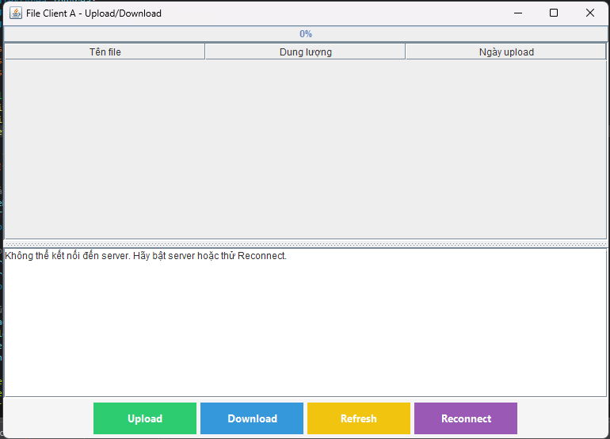
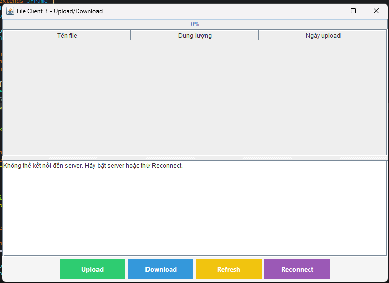

<h2 align="center">
    <a href="https://dainam.edu.vn/vi/khoa-cong-nghe-thong-tin">
    🎓 Faculty of Information Technology (DaiNam University)
    </a>
</h2>
<h2 align="center">
   TRUYỀN FILE QUA TCP
</h2>
<div align="center">
    <p align="center">
        
        
        
    </p>

[](https://www.facebook.com/DNUAIoTLab)
[](https://dainam.edu.vn/vi/khoa-cong-nghe-thong-tin)
[](https://dainam.edu.vn)

</div>


## 📖 1. Giới thiệu
Ứng dụng này mô phỏng việc **truyền file qua mạng** bằng mô hình **Client – Server**.  

- **Server**: đóng vai trò trung tâm, nơi lưu trữ các file và lắng nghe yêu cầu từ các Client.  
- **Client**: có thể upload file lên Server hoặc tải file từ Server về máy.  

Nói cách khác, chương trình cho phép nhiều máy tính trong cùng mạng (hoặc thông qua Internet) **chia sẻ file qua lại** một cách dễ dàng.  

**Mục tiêu chính:**  
- Hiểu nguyên lý hoạt động của giao thức TCP khi truyền dữ liệu.  
- Làm quen với cách xây dựng kết nối **Client – Server** trong Java.  
- Thực hành thao tác với file: gửi, nhận, lưu trữ.  

**Các chức năng chính:**  
- Upload file từ Client lên Server.  
- Download file từ Server về Client.  
- Server quản lý và hiển thị danh sách file.  
- Hỗ trợ nhiều Client kết nối cùng lúc.  

---

## 🛠️ 2. Công nghệ sử dụng  

- **Ngôn ngữ lập trình**: Java (JDK 8+).  
- **Giao thức mạng**: TCP Socket (`java.net.Socket`, `java.net.ServerSocket`).  
- **Xử lý đa luồng**: `Thread` để phục vụ nhiều Client đồng thời.  
- **Công nghệ giao diện**: Java Swing (JTable, JButton, JTextArea, JSplitPane).  
- **Cơ chế truyền dữ liệu**: `DataInputStream` và `DataOutputStream` để truyền file và lệnh (UPLOAD, DOWNLOAD, LIST).  
- **Thư viện sử dụng**:  
  - `java.net`  
  - `java.io`  
  - `javax.swing`, `java.awt`  
- **Công cụ phát triển**: IntelliJ IDEA / Eclipse / NetBeans (tùy chọn).  
- **Phiên bản JDK**: Java SE (JDK 8 trở lên).  
- **Hệ điều hành**: Windows 10 (có thể chạy đa nền tảng Linux, macOS).  


---

## 🚀 3. Một số hình ảnh hệ thống
### Giao diện Server

<p align="center">
  
</p>
<p align="center"><i>Hình ảnh 1</i></p>

### Giao diện ClientA

<p align="center">
  
</p>
<p align="center"><i>Hình ảnh 2</i></p>

### Giao diện ClientB

<p align="center">
  
</p>
<p align="center"><i>Hình ảnh 3</i></p>

### Giao diện Upload 

<p align="center">
  
</p>
<p align="center"><i>Hình ảnh 4</i></p>

---

## 📝 4. Các bước cài đặt

#### Bước 1: Chuẩn bị môi trường
1. **Kiểm tra Java**: Mở terminal/command prompt và chạy:
```bash
java -version
javac -version
```
Đảm bảo cả hai lệnh đều hiển thị phiên bản Java 8 trở lên.

#### Bước 2: Biên dịch mã nguồn
1. Mở terminal và điều hướng đến thư mục chứa mã nguồn.
2. Biên dịch các file Java:
```bash
javac server/Server.java
javac clienta/ClientA.java
```
- Hoặc biên dịch toàn bộ dự án:
```bash
javac LTM-1604-D03-File-TCP/**/*.java
```
3. Kiểm tra kết quả: Nếu biên dịch thành công, sẽ tạo ra các file `.class` tương ứng.

#### Bước 3: Chạy ứng dụng
Khởi động Server:
```bash
java server.Server
```
- Server sẽ tạo thư mục `server_files` nếu chưa có.
- Server lắng nghe kết nối TCP trên port `1234`.
- Giao diện server hiển thị danh sách file và log kết nối từ các Client.

Khởi động Client:
```bash
java clienta.ClientA
```
- Hoặc
```bash
java clienta.ClientB
```
- Client tạo thư mục `client_files` nếu chưa có.
- Client kết nối đến IP server (`SERVER_IP`) và port `1234`.
- Giao diện Client hiển thị danh sách file và log quá trình upload/download.

### 🚀 Sử dụng ứng dụng
1. Bật Server: Server sẵn sàng nhận kết nối từ Client
1. Kết nối: Client kết nối đến Server và log trên Server hiển thị các Client đang kết nối.
2. Upload file: Trên Client, chọn file từ máy nhấn Upload để gửi file lên Server, tiến trình hiển thị trên ProgressBar.
3. Download file: Client có thể chọn file trên Server để download về máy.
4. Lưu file: File sẽ được lưu vào thư mục client_files của Client.
5. Ngắt kết nối: Đóng cửa sổ Client hoặc nhấn Ctrl+C để ngắt kết nối.
6. Reconnect: Client yêu cầu kết nối lại tới Server.

---

## 5. Liên hệ cá nhân
Nếu có bất kỳ thắc mắc hoặc cần hỗ trợ, vui lòng liên hệ:

- 👨‍🎓 Họ và tên: Phạm Thành Hưng
- 🏫 Khoa: Công nghệ thông tin - Đại học Đại Nam
- 📧 Email: pthung0709@gmail.com


