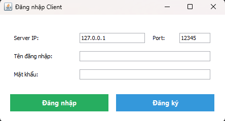

<h2 align="center">
    <a href="https://dainam.edu.vn/vi/khoa-cong-nghe-thong-tin">
    🎓 Faculty of Information Technology (DaiNam University)
    </a>
</h2>
<h2 align="center">
   TRUYỀN FILE QUA TCP
</h2>
<div align="center">
    <p align="center">
        
        
        
    </p>

[](https://www.facebook.com/DNUAIoTLab)
[](https://dainam.edu.vn/vi/khoa-cong-nghe-thong-tin)
[](https://dainam.edu.vn)

</div>

---

## 📖 1. Giới thiệu
Ứng dụng này mô phỏng việc **truyền file qua mạng TCP** theo mô hình **Client – Server**.  

- **Server**:  
  - Lắng nghe client kết nối qua Socket TCP.  
  - Xác thực tài khoản (đăng nhập/đăng ký) bằng **MySQL**.  
  - Quản lý danh sách client online.  
  - Trung gian truyền file giữa các client.  

- **Client**:  
  - `LoginUI`: Đăng nhập/Đăng ký với Server.  
  - `ClientUI`: Gửi/nhận file, đồng ý/từ chối, xem lịch sử truyền file.  

**Chức năng chính:**  
- Đăng ký và đăng nhập tài khoản (lưu CSDL MySQL, hash mật khẩu bằng BCrypt).  
- Gửi file từ một client → client khác thông qua server.  
- Nhận file và chọn Đồng ý hoặc Từ chối.  
- Cập nhật danh sách client online theo thời gian thực.  
- Ghi lại lịch sử gửi/nhận file vào bảng `file_history`. 

---

## 🛠️ 2. Công nghệ sử dụng  

<p align="center">
  
  
  
  
  
  
  
  
  
</p>

---

## 🚀 3. Một số hình ảnh hệ thống
### Giao diện Server

<p align="center">
  
</p>

### Giao diện đăng nhập và đăng ký

<p align="center">
  
</p>

### Giao diện Client

<p align="center">
  
</p>

### Chọn file để gửi

<p align="center">
  
</p>

### Nhận file từ client khác 

<p align="center">
  
</p>

### Đồng ý nhận file 

<p align="center">
  
</p>

### Từ chối nhận file 

<p align="center">
  
</p>

### Lịch sử gửi, nhận file

<p align="center">
  
</p>

---

## 📝 4. Các bước cài đặt

#### Bước 1: Chuẩn bị môi trường
1. **Cài đặt Java JDK** (phiên bản 8 trở lên).  
   Kiểm tra bằng lệnh:
   ```bash
   java -version
   javac -version
  ``
  
2. **Cài đặt MySQL và tạo CSDL mới:**
    ```bash
    CREATE DATABASE `ltm_1604_d03_file_tcp`;
    ```

#### Bước 2: Cấu hình Database
- Chỉnh sửa thông tin kết nối trong file `sql/SQL.java`:
```bash
config.setJdbcUrl("jdbc:mysql://localhost:3306/ltm_1604_d03_file_tcp?useSSL=false&serverTimezone=UTC");
config.setUsername("root");
config.setPassword("your_password_here");
```
- Server khi chạy lần đầu sẽ tự động tạo bảng `users` và `file_history`.

#### Bước 3: Biên dịch mã nguồn
- Mở terminal, điều hướng đến thư mục project và chạy:
```bash
javac -cp ".;lib/*" server\Server.java client\LoginUI.java client\Client.java sql\SQL.java
```
#### Bước 4: Chạy ứng dụng
1. Khởi động Server:
  ```bash
 java -cp ".;lib/*" server.Server
  ```
2. Khởi động Client (LoginUI):
  ```bash
  java -cp ".;lib/*" client.LoginUI
  ```

3. Gửi/Nhận File:
- Client chọn ID người nhận, chọn file và gửi.
- Người nhận sẽ thấy thông báo, có thể Đồng ý hoặc Từ chối.
- File được lưu mặc định trong thư mục downloads/.

---

## 📌 5. Liên hệ cá nhân
Nếu có bất kỳ thắc mắc hoặc cần hỗ trợ, vui lòng liên hệ:

- Họ và tên: Phạm Thành Hưng
- Lớp: CNTT 16-04
- Khoa: Công nghệ thông tin - Trường Đại học Đại Nam
- Email: pthung0709@gmail.com

© 2025 AIoTLab, Faculty of Information Technology, DaiNam University. All rights reserved.


